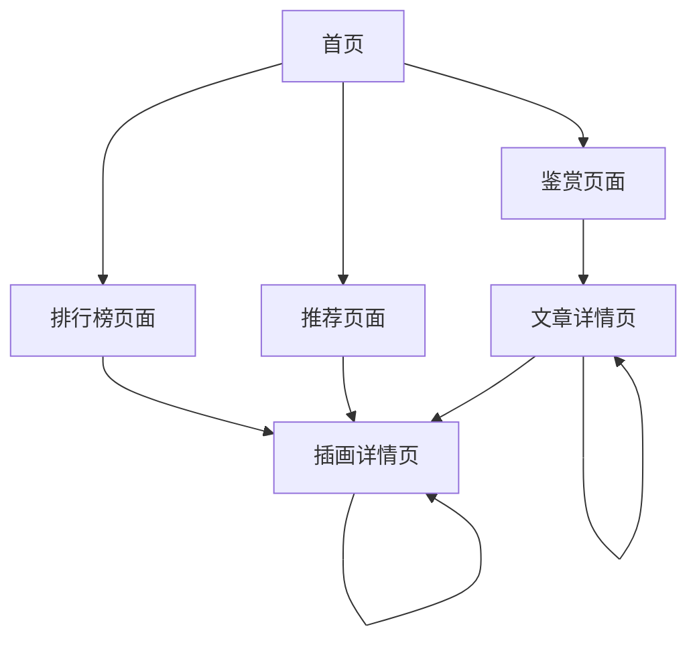

# Pixiv插画鉴赏网站产品需求文档

## 1. 产品概述

一个专注于pixiv插画展示和鉴赏的现代化网站，提供每日、每周、每月排行榜展示，个性化推荐系统，以及专业的插画鉴赏和画师推荐文章。
- 解决插画爱好者发现优质作品和了解画师创作背景的需求，为用户提供沉浸式的视觉体验和专业的艺术鉴赏内容。
- 目标打造成为插画艺术爱好者的首选平台，提升用户对插画艺术的理解和欣赏水平。

## 2. 核心功能

### 2.1 功能模块

我们的插画鉴赏网站包含以下主要页面：
1. **首页**：英雄区域展示、导航菜单、精选插画预览、快速入口
2. **排行榜页面**：每日/每周/每月排行榜切换、插画网格展示、筛选和排序功能
3. **推荐页面**：个性化推荐算法、分类推荐、新作推荐、热门推荐
4. **鉴赏页面**：文章列表、插画鉴赏详情、画师推荐专题、搜索功能
5. **插画详情页**：高清图片展示、作品信息、画师信息、相关推荐
6. **文章详情页**：富文本内容、图片展示、分享功能、相关文章推荐

### 2.2 页面详情

| 页面名称 | 模块名称 | 功能描述 |
|---------|---------|----------|
| 首页 | 英雄区域 | 展示精选插画轮播，包含毛玻璃背景效果和动态切换动画 |
| 首页 | 导航栏 | 固定顶部导航，包含排行榜、推荐、鉴赏三个主要入口，支持响应式布局 |
| 首页 | 精选预览 | 展示各模块的精选内容预览，采用卡片式布局和悬停动效 |
| 排行榜页面 | 时间切换器 | 提供每日、每周、每月三种时间维度切换，带有平滑过渡动画 |
| 排行榜页面 | 插画网格 | 瀑布流或网格布局展示排行榜插画，支持懒加载和无限滚动 |
| 排行榜页面 | 筛选器 | 按分类、标签、画师等维度筛选，实时更新结果 |
| 推荐页面 | 推荐算法展示 | 基于用户浏览历史的个性化推荐，分类展示不同类型推荐 |
| 推荐页面 | 分类推荐 | 按插画风格、主题、色彩等分类推荐，支持标签筛选 |
| 鉴赏页面 | 文章列表 | 展示插画鉴赏和画师推荐文章，支持分类和搜索 |
| 鉴赏页面 | 搜索功能 | 全文搜索文章内容，支持关键词高亮和搜索建议 |
| 插画详情页 | 图片展示 | 高清图片查看器，支持缩放、全屏、下载功能 |
| 插画详情页 | 作品信息 | 显示标题、描述、标签、创作时间等详细信息 |
| 插画详情页 | 相关推荐 | 基于当前作品推荐相似风格或同画师作品 |
| 文章详情页 | 富文本内容 | 支持图文混排的文章内容展示，优化阅读体验 |
| 文章详情页 | 分享功能 | 提供社交媒体分享和链接复制功能 |

## 3. 核心流程

用户主要操作流程如下：

**浏览流程**：用户进入首页 → 通过导航栏选择感兴趣的模块（排行榜/推荐/鉴赏）→ 浏览插画或文章列表 → 点击查看详情 → 通过相关推荐发现更多内容

**排行榜浏览流程**：进入排行榜页面 → 选择时间维度（每日/每周/每月）→ 应用筛选条件 → 浏览插画网格 → 点击查看插画详情

**推荐内容流程**：进入推荐页面 → 浏览个性化推荐内容 → 按分类查看不同类型推荐 → 查看插画详情

**鉴赏阅读流程**：进入鉴赏页面 → 浏览文章列表或使用搜索 → 点击阅读文章详情 → 查看文章中的插画作品 → 分享或查看相关文章

## 4. 用户界面设计

### 4.1 设计风格

- **主色调**：纯白色 (#FFFFFF) 和灰白色 (#F8F9FA)，辅助色为粉白色 (#FDF2F8)
- **次要色彩**：浅灰色 (#E5E7EB) 用于边框和分割线，深灰色 (#374151) 用于文字
- **按钮风格**：圆角按钮配合毛玻璃效果，悬停时增加阴影和轻微缩放
- **字体**：主标题使用 24-32px，正文使用 14-16px，采用系统字体栈确保最佳显示效果
- **布局风格**：卡片式设计配合毛玻璃背景，顶部固定导航栏，内容区域采用网格和瀑布流布局
- **图标风格**：线性图标配合柔和的圆角设计，支持动态效果

### 4.2 页面设计概览

| 页面名称 | 模块名称 | UI元素 |
|---------|---------|--------|
| 首页 | 英雄区域 | 全屏背景图片配合毛玻璃遮罩，渐变文字叠加，动态粒子效果，响应式图片适配 |
| 首页 | 导航栏 | 半透明白色背景，毛玻璃模糊效果，悬停时按钮背景变化，移动端汉堡菜单 |
| 首页 | 精选预览 | 卡片式布局，圆角阴影，悬停时轻微上浮动效，加载时骨架屏动画 |
| 排行榜页面 | 时间切换器 | 分段控制器样式，选中状态带有滑动指示器，平滑过渡动画 |
| 排行榜页面 | 插画网格 | 响应式网格布局，图片懒加载，悬停时显示遮罩和操作按钮，无限滚动加载 |
| 推荐页面 | 推荐卡片 | 大卡片展示推荐内容，渐变背景，标签云样式的分类标签 |
| 鉴赏页面 | 文章卡片 | 图文结合的卡片设计，阅读时间估算，作者头像和信息展示 |
| 插画详情页 | 图片查看器 | 全屏模态框，支持手势缩放，工具栏半透明悬浮，背景毛玻璃模糊 |
| 文章详情页 | 内容区域 | 优化的阅读排版，代码块语法高亮，图片点击放大，目录导航侧边栏 |

### 4.3 响应式设计

网站采用移动优先的响应式设计策略，支持桌面端、平板端和移动端的完美适配。在移动端优化触摸交互体验，包括手势滑动、长按操作等。桌面端充分利用大屏幕空间，提供更丰富的交互效果和信息展示。