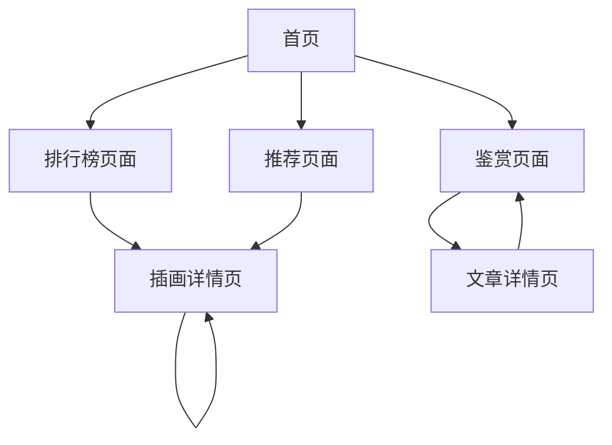

# Pixiv插画鉴赏网站产品需求文档

## 1. 产品概述

一个专注于pixiv插画展示和鉴赏的网站平台，提供每日、每周、每月排行榜插画展示，每日推荐插画，以及插画鉴赏和画师推荐文章。
- 为插画爱好者提供高质量的插画内容浏览和发现体验，无需注册登录即可享受完整功能。
- 通过精美的毛玻璃界面设计和丰富的动态效果，打造沉浸式的视觉体验平台。

## 2. 核心功能

### 2.1 用户角色
本产品无需用户登录，所有访客均可浏览全部内容。

### 2.2 功能模块

我们的插画鉴赏网站包含以下主要页面：
1. **首页**：轮播展示、导航菜单、热门推荐预览
2. **排行榜页面**：每日/每周/每月排行榜切换、插画网格展示、筛选功能
3. **推荐页面**：每日推荐插画、个性化推荐算法展示
4. **鉴赏页面**：插画鉴赏文章列表、画师推荐文章、文章详情
5. **插画详情页**：大图展示、作品信息、相关推荐
6. **文章详情页**：文章内容、相关文章推荐

### 2.3 页面详情

| 页面名称 | 模块名称 | 功能描述 |
|---------|---------|----------|
| 首页 | 轮播展示区 | 展示精选插画，支持自动轮播和手动切换，毛玻璃背景效果 |
| 首页 | 导航菜单 | 顶部固定导航，包含排行榜、推荐、鉴赏三个主要入口，半透明磨砂效果 |
| 首页 | 热门预览 | 展示各模块热门内容预览，卡片式布局，悬停动效 |
| 排行榜页面 | 时间切换器 | 每日/每周/每月排行榜切换，标签式设计，动态切换效果 |
| 排行榜页面 | 插画网格 | 瀑布流或网格布局展示插画，懒加载，图片悬停放大效果 |
| 排行榜页面 | 筛选功能 | 按分类、标签筛选插画，侧边栏或顶部筛选器 |
| 推荐页面 | 每日推荐 | 展示当日精选推荐插画，大卡片布局，渐变背景 |
| 推荐页面 | 智能推荐 | 基于浏览历史的个性化推荐，网格布局，加载动画 |
| 鉴赏页面 | 文章列表 | 插画鉴赏和画师推荐文章列表，卡片式布局，分页加载 |
| 鉴赏页面 | 分类导航 | 文章分类筛选，标签云或分类菜单 |
| 插画详情页 | 大图展示 | 高清插画展示，支持缩放，毛玻璃背景 |
| 插画详情页 | 作品信息 | 显示作者、标签、收藏数等信息，半透明信息卡 |
| 插画详情页 | 相关推荐 | 推荐相似插画，横向滚动布局 |
| 文章详情页 | 文章内容 | 富文本文章内容展示，优雅的排版设计 |
| 文章详情页 | 相关推荐 | 相关文章推荐，侧边栏或底部推荐区 |

## 3. 核心流程

用户主要操作流程：
1. 访问首页 → 浏览轮播内容和热门预览
2. 点击导航进入排行榜 → 选择时间维度 → 浏览插画 → 点击查看详情
3. 进入推荐页面 → 浏览每日推荐和智能推荐内容
4. 进入鉴赏页面 → 浏览文章列表 → 点击阅读文章详情
5. 在任意插画详情页 → 查看大图和作品信息 → 浏览相关推荐

## 4. 用户界面设计

### 4.1 设计风格

- **主色调**：白色 (#FFFFFF)、灰白色 (#F8F9FA)、粉白色 (#FDF2F8)
- **辅助色**：浅灰色 (#E5E7EB)、中灰色 (#9CA3AF)
- **按钮样式**：圆角按钮，毛玻璃效果，悬停时透明度变化
- **字体**：主要使用 Inter、思源黑体，标题 18-24px，正文 14-16px
- **布局风格**：卡片式设计，大量留白，毛玻璃和半透明效果
- **图标风格**：线性图标，简洁现代，支持动态效果

### 4.2 页面设计概览

| 页面名称 | 模块名称 | UI元素 |
|---------|---------|--------|
| 首页 | 轮播展示区 | 全屏轮播，毛玻璃背景叠加，白色半透明文字区域，圆点指示器 |
| 首页 | 导航菜单 | 顶部固定，backdrop-blur-md效果，白色半透明背景，悬停动画 |
| 首页 | 热门预览 | 3列网格布局，卡片阴影效果，悬停时轻微上浮和阴影加深 |
| 排行榜页面 | 时间切换器 | 标签式设计，选中状态渐变背景，切换时滑动动画 |
| 排行榜页面 | 插画网格 | 响应式网格，图片圆角，悬停时放大1.05倍，加载时骨架屏 |
| 推荐页面 | 每日推荐 | 大卡片布局，渐变背景，文字阴影，CTA按钮毛玻璃效果 |
| 鉴赏页面 | 文章列表 | 卡片式布局，左侧缩略图，右侧文字信息，分割线使用浅灰色 |
| 插画详情页 | 大图展示 | 居中展示，背景模糊处理，图片边框圆角，缩放按钮毛玻璃效果 |

### 4.3 响应式设计

- **桌面优先设计**：主要针对1920x1080及以上分辨率优化
- **移动端适配**：支持768px以下设备，导航折叠，网格布局调整为单列或双列
- **触摸优化**：移动端增大点击区域，支持手势操作，优化滚动体验
- **动效适配**：移动端减少复杂动画，保持流畅性能