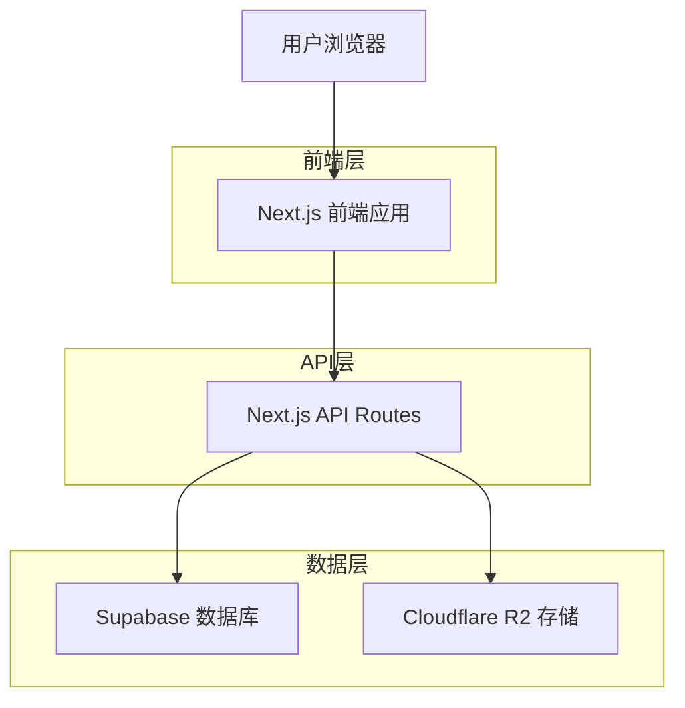
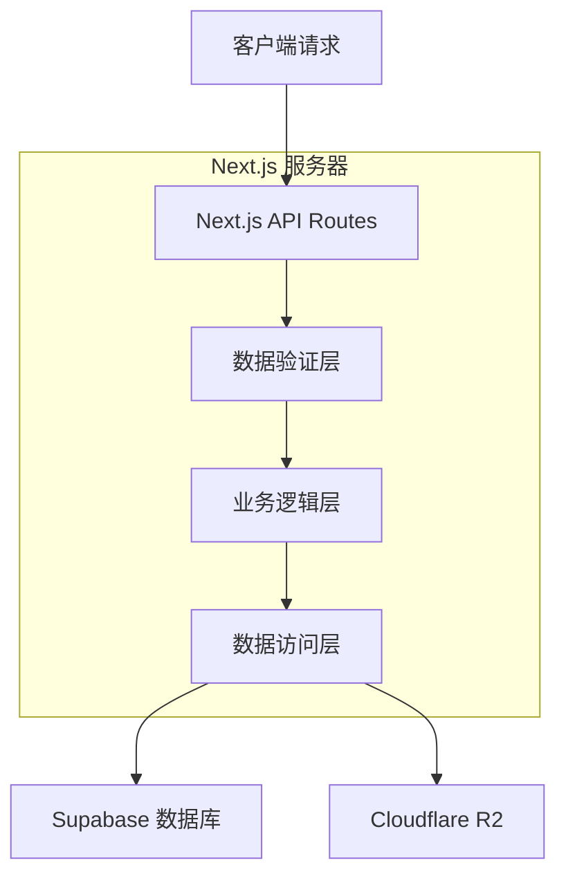
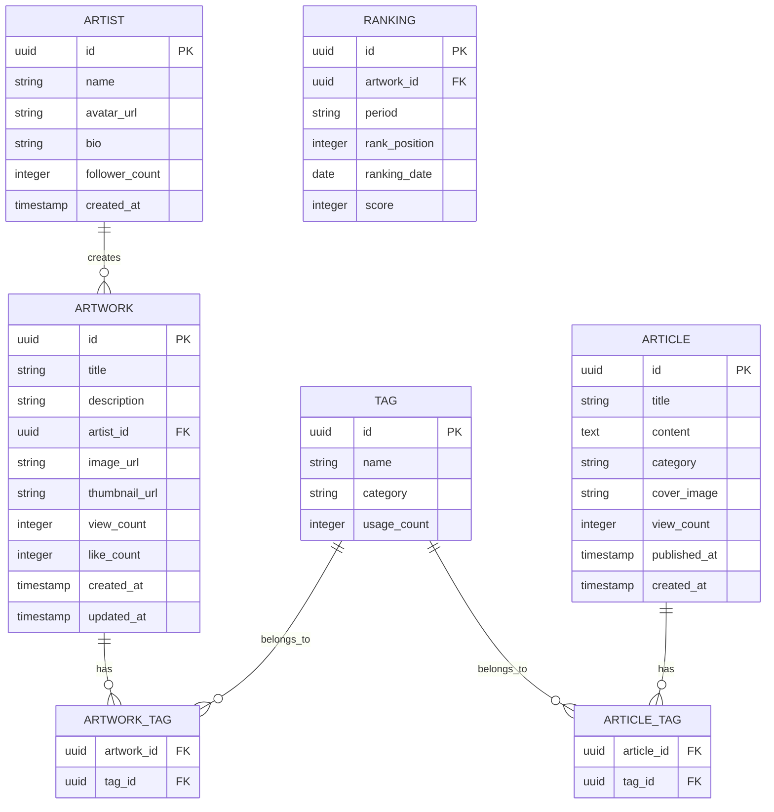

# Pixiv插画鉴赏网站技术架构文档

## 1. 架构设计



## 2. 技术描述

- **前端**: Next.js 14 + React 18 + TypeScript + Tailwind CSS + Framer Motion
- **后端**: Next.js API Routes + Supabase SDK
- **数据库**: Supabase (PostgreSQL)
- **文件存储**: Cloudflare R2
- **样式**: Tailwind CSS + CSS Modules
- **动画**: Framer Motion + CSS Transitions

## 3. 路由定义

| 路由 | 用途 |
|------|------|
| / | 首页，展示轮播内容和各模块预览 |
| /rankings | 排行榜页面，支持每日/每周/每月切换 |
| /recommendations | 推荐页面，展示每日推荐和智能推荐 |
| /articles | 鉴赏页面，插画鉴赏和画师推荐文章列表 |
| /artwork/[id] | 插画详情页，展示高清图片和作品信息 |
| /article/[id] | 文章详情页，展示文章内容和相关推荐 |

## 4. API定义

### 4.1 核心API

**获取排行榜插画**
```
GET /api/rankings
```

请求参数:
| 参数名 | 参数类型 | 是否必需 | 描述 |
|--------|----------|----------|------|
| period | string | true | 时间维度: daily/weekly/monthly |
| page | number | false | 页码，默认为1 |
| limit | number | false | 每页数量，默认为20 |

响应:
| 参数名 | 参数类型 | 描述 |
|--------|----------|------|
| success | boolean | 请求状态 |
| data | Artwork[] | 插画数据数组 |
| pagination | object | 分页信息 |

**获取推荐插画**
```
GET /api/recommendations
```

请求参数:
| 参数名 | 参数类型 | 是否必需 | 描述 |
|--------|----------|----------|------|
| type | string | true | 推荐类型: daily/smart |
| page | number | false | 页码，默认为1 |

**获取文章列表**
```
GET /api/articles
```

请求参数:
| 参数名 | 参数类型 | 是否必需 | 描述 |
|--------|----------|----------|------|
| category | string | false | 文章分类: review/artist |
| page | number | false | 页码，默认为1 |

**获取插画详情**
```
GET /api/artwork/[id]
```

响应:
| 参数名 | 参数类型 | 描述 |
|--------|----------|------|
| success | boolean | 请求状态 |
| data | Artwork | 插画详细信息 |
| related | Artwork[] | 相关推荐插画 |

**获取文章详情**
```
GET /api/article/[id]
```

响应:
| 参数名 | 参数类型 | 描述 |
|--------|----------|------|
| success | boolean | 请求状态 |
| data | Article | 文章详细内容 |
| related | Article[] | 相关推荐文章 |

示例响应:
```json
{
  "success": true,
  "data": {
    "id": "123456",
    "title": "美丽的樱花插画",
    "artist": "画师名称",
    "imageUrl": "https://r2.example.com/images/123456.jpg",
    "tags": ["樱花", "春天", "风景"],
    "viewCount": 1500,
    "likeCount": 320
  }
}
```

## 5. 服务器架构图



## 6. 数据模型

### 6.1 数据模型定义



### 6.2 数据定义语言

**插画表 (artworks)**
```sql
-- 创建插画表
CREATE TABLE artworks (
    id UUID PRIMARY KEY DEFAULT gen_random_uuid(),
    title VARCHAR(255) NOT NULL,
    description TEXT,
    artist_id UUID REFERENCES artists(id),
    image_url TEXT NOT NULL,
    thumbnail_url TEXT NOT NULL,
    view_count INTEGER DEFAULT 0,
    like_count INTEGER DEFAULT 0,
    created_at TIMESTAMP WITH TIME ZONE DEFAULT NOW(),
    updated_at TIMESTAMP WITH TIME ZONE DEFAULT NOW()
);

-- 创建索引
CREATE INDEX idx_artworks_artist_id ON artworks(artist_id);
CREATE INDEX idx_artworks_created_at ON artworks(created_at DESC);
CREATE INDEX idx_artworks_like_count ON artworks(like_count DESC);
CREATE INDEX idx_artworks_view_count ON artworks(view_count DESC);
```

**画师表 (artists)**
```sql
-- 创建画师表
CREATE TABLE artists (
    id UUID PRIMARY KEY DEFAULT gen_random_uuid(),
    name VARCHAR(100) NOT NULL,
    avatar_url TEXT,
    bio TEXT,
    follower_count INTEGER DEFAULT 0,
    created_at TIMESTAMP WITH TIME ZONE DEFAULT NOW()
);

-- 创建索引
CREATE INDEX idx_artists_name ON artists(name);
CREATE INDEX idx_artists_follower_count ON artists(follower_count DESC);
```

**标签表 (tags)**
```sql
-- 创建标签表
CREATE TABLE tags (
    id UUID PRIMARY KEY DEFAULT gen_random_uuid(),
    name VARCHAR(50) UNIQUE NOT NULL,
    category VARCHAR(20) DEFAULT 'general',
    usage_count INTEGER DEFAULT 0
);

-- 创建索引
CREATE INDEX idx_tags_name ON tags(name);
CREATE INDEX idx_tags_usage_count ON tags(usage_count DESC);
```

**插画标签关联表 (artwork_tags)**
```sql
-- 创建插画标签关联表
CREATE TABLE artwork_tags (
    artwork_id UUID REFERENCES artworks(id) ON DELETE CASCADE,
    tag_id UUID REFERENCES tags(id) ON DELETE CASCADE,
    PRIMARY KEY (artwork_id, tag_id)
);

-- 创建索引
CREATE INDEX idx_artwork_tags_artwork_id ON artwork_tags(artwork_id);
CREATE INDEX idx_artwork_tags_tag_id ON artwork_tags(tag_id);
```

**文章表 (articles)**
```sql
-- 创建文章表
CREATE TABLE articles (
    id UUID PRIMARY KEY DEFAULT gen_random_uuid(),
    title VARCHAR(255) NOT NULL,
    content TEXT NOT NULL,
    category VARCHAR(20) DEFAULT 'review' CHECK (category IN ('review', 'artist')),
    cover_image TEXT,
    view_count INTEGER DEFAULT 0,
    published_at TIMESTAMP WITH TIME ZONE DEFAULT NOW(),
    created_at TIMESTAMP WITH TIME ZONE DEFAULT NOW()
);

-- 创建索引
CREATE INDEX idx_articles_category ON articles(category);
CREATE INDEX idx_articles_published_at ON articles(published_at DESC);
CREATE INDEX idx_articles_view_count ON articles(view_count DESC);
```

**排行榜表 (rankings)**
```sql
-- 创建排行榜表
CREATE TABLE rankings (
    id UUID PRIMARY KEY DEFAULT gen_random_uuid(),
    artwork_id UUID REFERENCES artworks(id) ON DELETE CASCADE,
    period VARCHAR(10) NOT NULL CHECK (period IN ('daily', 'weekly', 'monthly')),
    rank_position INTEGER NOT NULL,
    ranking_date DATE NOT NULL,
    score INTEGER DEFAULT 0
);

-- 创建索引
CREATE INDEX idx_rankings_period_date ON rankings(period, ranking_date DESC);
CREATE INDEX idx_rankings_artwork_id ON rankings(artwork_id);
CREATE UNIQUE INDEX idx_rankings_unique ON rankings(artwork_id, period, ranking_date);
```

**权限设置**
```sql
-- 为匿名用户授予读取权限
GRANT SELECT ON artworks TO anon;
GRANT SELECT ON artists TO anon;
GRANT SELECT ON tags TO anon;
GRANT SELECT ON artwork_tags TO anon;
GRANT SELECT ON articles TO anon;
GRANT SELECT ON rankings TO anon;

-- 为认证用户授予完整权限（如果将来需要管理功能）
GRANT ALL PRIVILEGES ON artworks TO authenticated;
GRANT ALL PRIVILEGES ON artists TO authenticated;
GRANT ALL PRIVILEGES ON tags TO authenticated;
GRANT ALL PRIVILEGES ON artwork_tags TO authenticated;
GRANT ALL PRIVILEGES ON articles TO authenticated;
GRANT ALL PRIVILEGES ON rankings TO authenticated;
```