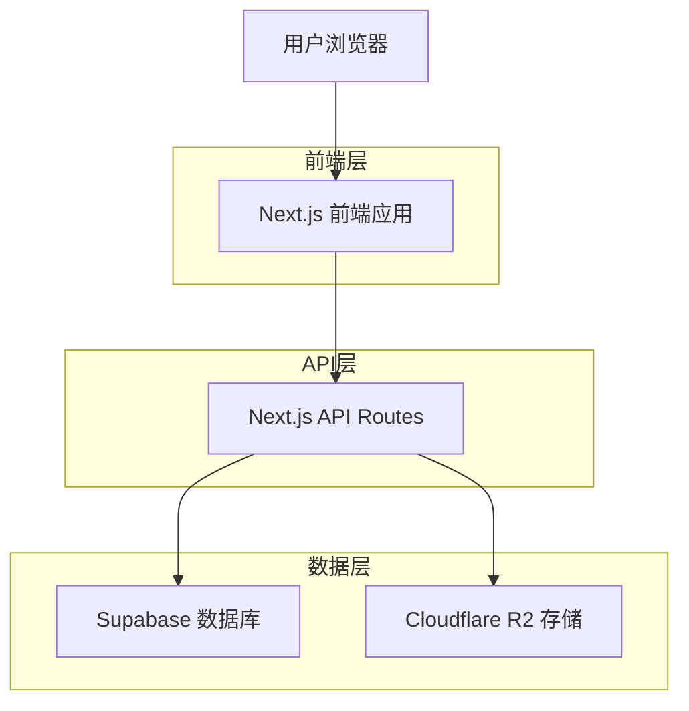
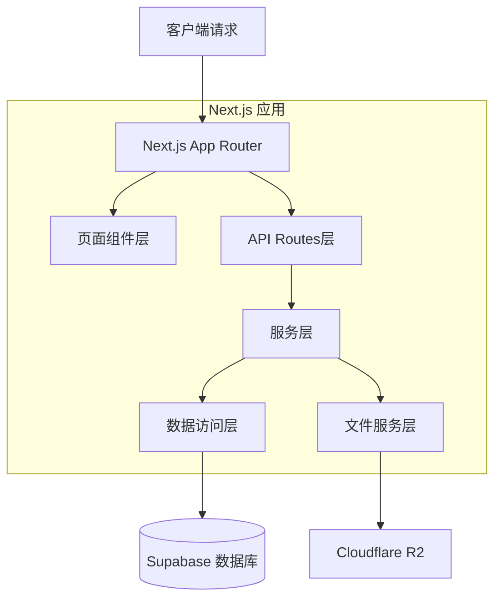
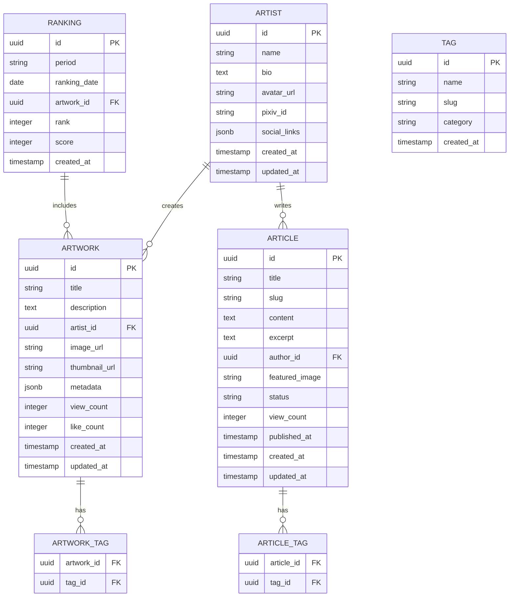

# Pixiv插画鉴赏网站技术架构文档

## 1. 架构设计



## 2. 技术描述

- **前端**: Next.js 14+ (App Router) + TypeScript + Tailwind CSS + Framer Motion
- **后端**: Next.js API Routes + Supabase SDK
- **数据库**: Supabase (PostgreSQL)
- **文件存储**: Cloudflare R2
- **部署**: Vercel

## 3. 路由定义

| 路由 | 用途 |
|------|------|
| / | 首页，展示精选内容和导航入口 |
| /rankings | 排行榜页面，支持每日/每周/每月切换 |
| /rankings/[period] | 特定时间段的排行榜 |
| /recommendations | 推荐页面，个性化内容推荐 |
| /gallery | 鉴赏页面，文章和专题列表 |
| /gallery/[slug] | 文章详情页面 |
| /artwork/[id] | 插画作品详情页面 |
| /artist/[id] | 画师信息页面 |

## 4. API定义

### 4.1 核心API

**插画排行榜相关**
```
GET /api/rankings
```

请求参数:
| 参数名 | 参数类型 | 是否必需 | 描述 |
|--------|----------|----------|------|
| period | string | true | 时间段: 'daily', 'weekly', 'monthly' |
| page | number | false | 页码，默认为1 |
| limit | number | false | 每页数量，默认为20 |
| category | string | false | 分类筛选 |

响应:
| 参数名 | 参数类型 | 描述 |
|--------|----------|------|
| success | boolean | 请求状态 |
| data | array | 插画列表数据 |
| pagination | object | 分页信息 |

示例:
```json
{
  "success": true,
  "data": [
    {
      "id": "12345",
      "title": "美丽的风景",
      "artist_name": "画师名称",
      "image_url": "https://r2.example.com/image.jpg",
      "thumbnail_url": "https://r2.example.com/thumb.jpg",
      "tags": ["风景", "自然"],
      "rank": 1,
      "score": 9850
    }
  ],
  "pagination": {
    "current_page": 1,
    "total_pages": 50,
    "total_items": 1000
  }
}
```

**推荐内容相关**
```
GET /api/recommendations
```

请求参数:
| 参数名 | 参数类型 | 是否必需 | 描述 |
|--------|----------|----------|------|
| type | string | false | 推荐类型: 'trending', 'new', 'similar' |
| limit | number | false | 返回数量，默认为12 |

**鉴赏文章相关**
```
GET /api/articles
```

请求参数:
| 参数名 | 参数类型 | 是否必需 | 描述 |
|--------|----------|----------|------|
| category | string | false | 文章分类 |
| search | string | false | 搜索关键词 |
| page | number | false | 页码 |

**插画详情相关**
```
GET /api/artwork/[id]
```

响应:
| 参数名 | 参数类型 | 描述 |
|--------|----------|------|
| id | string | 作品ID |
| title | string | 作品标题 |
| description | string | 作品描述 |
| artist | object | 画师信息 |
| images | array | 图片URL列表 |
| tags | array | 标签列表 |
| stats | object | 统计信息（浏览量、点赞数等） |
| related | array | 相关作品推荐 |

## 5. 服务器架构图



## 6. 数据模型

### 6.1 数据模型定义



### 6.2 数据定义语言

**插画作品表 (artworks)**
```sql
-- 创建表
CREATE TABLE artworks (
    id UUID PRIMARY KEY DEFAULT gen_random_uuid(),
    title VARCHAR(255) NOT NULL,
    description TEXT,
    artist_id UUID NOT NULL REFERENCES artists(id),
    image_url TEXT NOT NULL,
    thumbnail_url TEXT NOT NULL,
    metadata JSONB DEFAULT '{}',
    view_count INTEGER DEFAULT 0,
    like_count INTEGER DEFAULT 0,
    created_at TIMESTAMP WITH TIME ZONE DEFAULT NOW(),
    updated_at TIMESTAMP WITH TIME ZONE DEFAULT NOW()
);

-- 创建索引
CREATE INDEX idx_artworks_artist_id ON artworks(artist_id);
CREATE INDEX idx_artworks_created_at ON artworks(created_at DESC);
CREATE INDEX idx_artworks_view_count ON artworks(view_count DESC);
CREATE INDEX idx_artworks_like_count ON artworks(like_count DESC);

-- 权限设置
GRANT SELECT ON artworks TO anon;
GRANT ALL PRIVILEGES ON artworks TO authenticated;
```

**画师表 (artists)**
```sql
CREATE TABLE artists (
    id UUID PRIMARY KEY DEFAULT gen_random_uuid(),
    name VARCHAR(100) NOT NULL,
    bio TEXT,
    avatar_url TEXT,
    pixiv_id VARCHAR(50) UNIQUE,
    social_links JSONB DEFAULT '{}',
    created_at TIMESTAMP WITH TIME ZONE DEFAULT NOW(),
    updated_at TIMESTAMP WITH TIME ZONE DEFAULT NOW()
);

CREATE INDEX idx_artists_pixiv_id ON artists(pixiv_id);
CREATE INDEX idx_artists_name ON artists(name);

GRANT SELECT ON artists TO anon;
GRANT ALL PRIVILEGES ON artists TO authenticated;
```

**文章表 (articles)**
```sql
CREATE TABLE articles (
    id UUID PRIMARY KEY DEFAULT gen_random_uuid(),
    title VARCHAR(255) NOT NULL,
    slug VARCHAR(255) UNIQUE NOT NULL,
    content TEXT NOT NULL,
    excerpt TEXT,
    author_id UUID NOT NULL REFERENCES artists(id),
    featured_image TEXT,
    status VARCHAR(20) DEFAULT 'published' CHECK (status IN ('draft', 'published', 'archived')),
    view_count INTEGER DEFAULT 0,
    published_at TIMESTAMP WITH TIME ZONE,
    created_at TIMESTAMP WITH TIME ZONE DEFAULT NOW(),
    updated_at TIMESTAMP WITH TIME ZONE DEFAULT NOW()
);

CREATE INDEX idx_articles_slug ON articles(slug);
CREATE INDEX idx_articles_status ON articles(status);
CREATE INDEX idx_articles_published_at ON articles(published_at DESC);
CREATE INDEX idx_articles_author_id ON articles(author_id);

GRANT SELECT ON articles TO anon;
GRANT ALL PRIVILEGES ON articles TO authenticated;
```

**排行榜表 (rankings)**
```sql
CREATE TABLE rankings (
    id UUID PRIMARY KEY DEFAULT gen_random_uuid(),
    period VARCHAR(20) NOT NULL CHECK (period IN ('daily', 'weekly', 'monthly')),
    ranking_date DATE NOT NULL,
    artwork_id UUID NOT NULL REFERENCES artworks(id),
    rank INTEGER NOT NULL,
    score INTEGER NOT NULL,
    created_at TIMESTAMP WITH TIME ZONE DEFAULT NOW()
);

CREATE UNIQUE INDEX idx_rankings_period_date_rank ON rankings(period, ranking_date, rank);
CREATE INDEX idx_rankings_artwork_id ON rankings(artwork_id);
CREATE INDEX idx_rankings_period_date ON rankings(period, ranking_date DESC);

GRANT SELECT ON rankings TO anon;
GRANT ALL PRIVILEGES ON rankings TO authenticated;
```

**标签表 (tags)**
```sql
CREATE TABLE tags (
    id UUID PRIMARY KEY DEFAULT gen_random_uuid(),
    name VARCHAR(100) NOT NULL UNIQUE,
    slug VARCHAR(100) NOT NULL UNIQUE,
    category VARCHAR(50) DEFAULT 'general',
    created_at TIMESTAMP WITH TIME ZONE DEFAULT NOW()
);

CREATE INDEX idx_tags_category ON tags(category);
CREATE INDEX idx_tags_name ON tags(name);

GRANT SELECT ON tags TO anon;
GRANT ALL PRIVILEGES ON tags TO authenticated;
```

**插画标签关联表 (artwork_tags)**
```sql
CREATE TABLE artwork_tags (
    artwork_id UUID NOT NULL REFERENCES artworks(id) ON DELETE CASCADE,
    tag_id UUID NOT NULL REFERENCES tags(id) ON DELETE CASCADE,
    PRIMARY KEY (artwork_id, tag_id)
);

CREATE INDEX idx_artwork_tags_artwork_id ON artwork_tags(artwork_id);
CREATE INDEX idx_artwork_tags_tag_id ON artwork_tags(tag_id);

GRANT SELECT ON artwork_tags TO anon;
GRANT ALL PRIVILEGES ON artwork_tags TO authenticated;
```

**文章标签关联表 (article_tags)**
```sql
CREATE TABLE article_tags (
    article_id UUID NOT NULL REFERENCES articles(id) ON DELETE CASCADE,
    tag_id UUID NOT NULL REFERENCES tags(id) ON DELETE CASCADE,
    PRIMARY KEY (article_id, tag_id)
);

CREATE INDEX idx_article_tags_article_id ON article_tags(article_id);
CREATE INDEX idx_article_tags_tag_id ON article_tags(tag_id);

GRANT SELECT ON article_tags TO anon;
GRANT ALL PRIVILEGES ON article_tags TO authenticated;
```